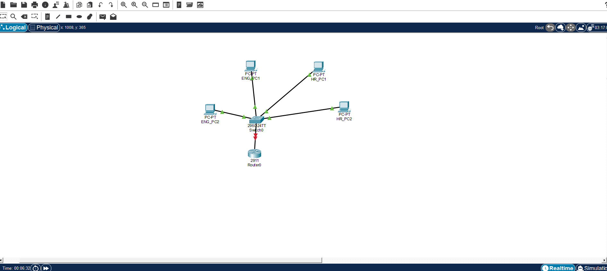

# Secure Corporate Network Segmentation & Inter-VLAN Routing

##  Project Overview
This project demonstrates the design and implementation of a segmented corporate network using **Virtual Local Area Networks (VLANs)** to logically isolate departments sharing the same physical infrastructure. A **Router-on-a-Stick (RoaS)** architecture was deployed using **802.1Q encapsulation** to allow secure, controlled inter-VLAN routing between the isolated subnets via a single physical Gigabit Ethernet trunk link.


##  Network Components & Topology Design
The infrastructure utilizes a modular design separating the broadcast domains of two distinct corporate units: **Engineering** and **HR**.

* **Layer 3 Router:** 1 x Cisco 2911 Integrated Services Router (ISR)
* **Layer 2 Switch:** 1 x Cisco Catalyst 2960 Switch
* **Workstations:** 4 x Desktop PCs (segmented into two groups of two)
* **Media / Cabling:** Copper Straight-Through Cables (Ethernet)

### Physical Connections & Port Assignments:
* **Engineering Department:** Ports `FastEthernet0/1` and `FastEthernet0/2`
* **HR Department:** Ports `FastEthernet0/10` and `FastEthernet0/11`
* **Router Trunk Uplink:** Switch port `GigabitEthernet0/1` -> Router port `GigabitEthernet0/0`




##  Logical Addressing & Segmentation Schema
Two distinct Class C private subnets were established to ensure complete logical boundary separation at Layer 3.

| Department | VLAN ID | Subnet Range | Gateway IP | Assigned Switch Ports |
| :--- | :--- | :--- | :--- | :--- |
| **Engineering** | `10` | `192.168.10.0/24` | `192.168.10.1` | `Fa0/1 - Fa0/2` |
| **HR** | `20` | `192.168.20.0/24` | `192.168.20.1` | `Fa0/10 - Fa0/11` |


## Configuration & Implementation Details

### 1. Switch VLAN and Trunking Configuration
Virtual networks were established on the Catalyst 2960 switch CLI, assigning access ports to their respective VLAN broadcast domains and designating the router uplink port as an IEEE 802.1Q trunk link:


### 2. Router-on-a-Stick (RoaS) Configuration
Instead of using individual physical interfaces for each subnet, the router’s single physical `gi0/0` interface was activated and provisioned into distinct logical sub-interfaces to handle tagged VLAN packets:

```text
! Enabling the physical interface
Router(config)# interface gi0/0
Router(config-if)# no shutdown

! Creating Sub-interface for Engineering (VLAN 10)
Router(config)# interface gi0/0.10
Router(config-subif)# encapsulation dot1Q 10
Router(config-subif)# ip address 192.168.10.1 255.255.255.0

! Creating Sub-interface for HR (VLAN 20)
Router(config)# interface gi0/0.20
Router(config-subif)# encapsulation dot1Q 20
Router(config-subif)# ip address 192.168.20.1 255.255.255.0
